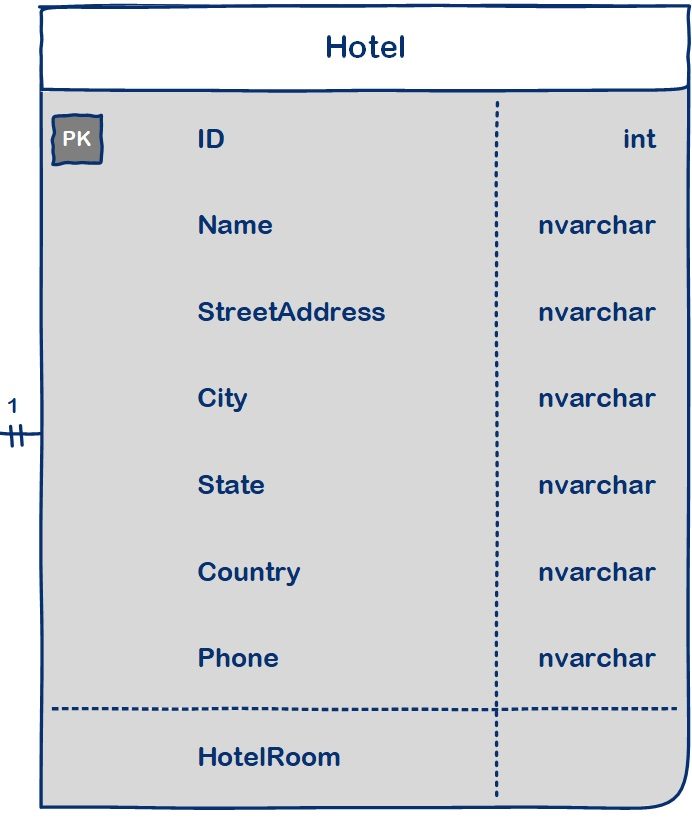
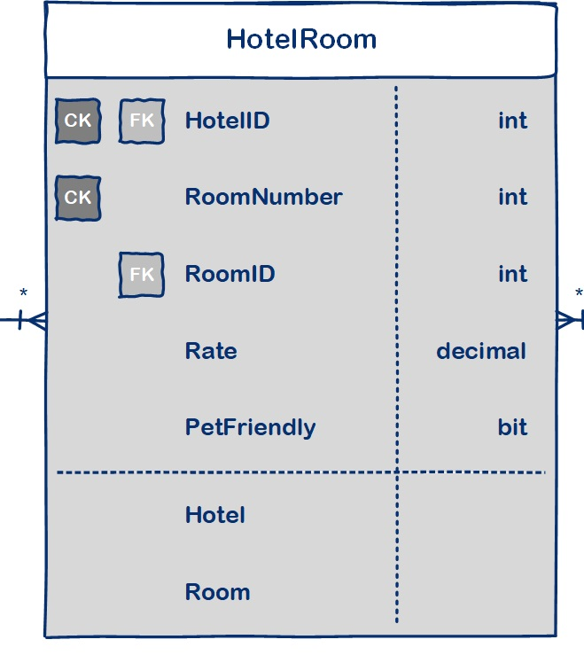
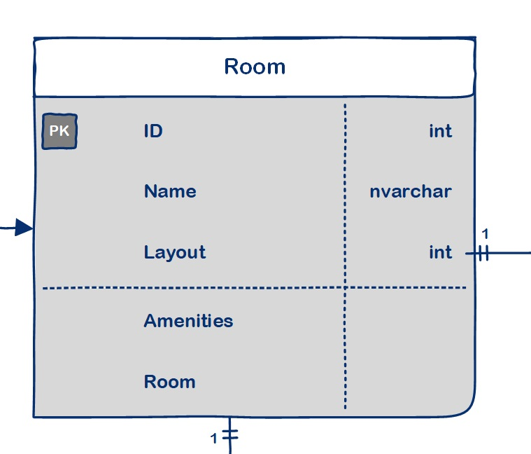
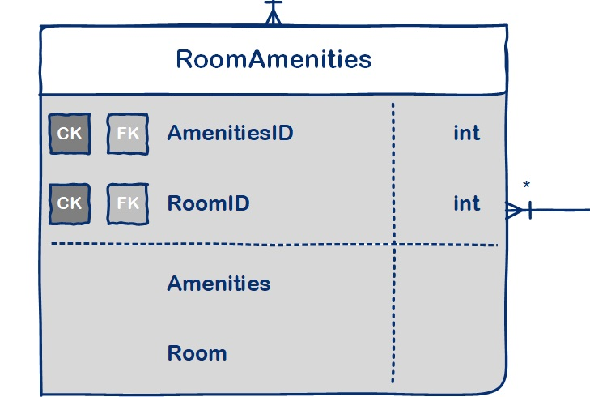
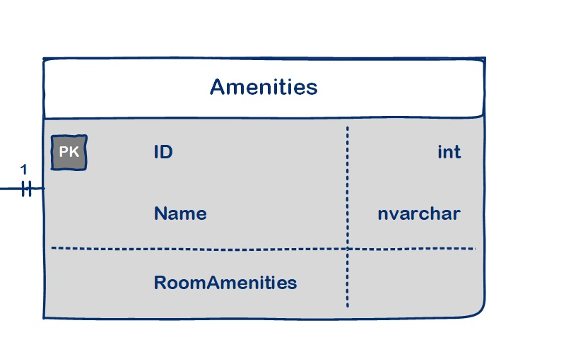

# Async-Inn

# Description

This ERD will be used during Async Inn project. The Hotel table allows us to create a properties for the hotel branch. The Hotel id is passed to the Rooms table , where the Rooms  get another id from room and used to create a unique room. The unique room is have amenities like air conditioning”, “coffee maker”, “ocean view”, “mini bar”.

| Contents | Link |
| -------- | -------- |
| Read: Lab 13 | [Read-Lab 13](./Async-Inn-2/Data/Image/Lab13.md) |
| Read: Lab 14 | [Read-Lab 14](./Async-Inn-2/Data/Image/Lab14.md) |
| Read: Lab 16 | [Read-Lab 16](./Async-Inn-2/Data/Image/Lab16.md) |
| Read: Lab 17 | [Read-Lab 17](./Async-Inn-2/Data/Image/Lab17.md) |
| Read: Lab 18 | [Read-Lab 18](./Async-Inn-2/Data/Image/Lab18.md) |

# ERD:

# Explanation :
Table 1:

Hotel Table : have primary key (hotel ID), and the name, city, state, address, and phone number as attributes . Relationship is (one-to-many) with the join table HotleRoom because every hotel have many room but the room have one hotel.

Table 2:

HotelRoom Table : have primary key (HotelRoomID) , room number, location,  pet friendly, price, as attributes , HotleID , RoomID as foreign keys, where any room can prat of hotel, relationship is (many to one) with hotelbID table  and (many to one) with RoomID table.

Table 3:

Room Table  : have primary key (Room ID) , nickname, layout, Room Amenities, as attributes, have relationship is (one to many) with HotelRoom table and (one to many) with Room Amenities table. 

Table 4:

Room AmenitiesTable:  have primary key (RoomAmenitiesID), and RoomID , AmenitiesID as foreign keys. and have relationship is (many to one) with Room table and (one to many) with  Amenities table, where every room have many Amenities by room Amenities use .

Table 5:

AmenitiesTable:  have primary key (AmenitiesID) ,air conditioning, coffee maker, ocean view, mini bar, RoomID, and have relationship is (one to many) with Room Amenities table. where every room have many Amenities by room Amenities use .

# MVC and EF Get Started

We create ASP.NET Core Empty project in VS and start to use MVC, Where we creat Models folder and insid it we creat all the classes for table, after that we create a new Data and add a new AsyncInnDbContext, it work as a bridge between our domain or entity classes and the database. After the database is registered, and a single table property inside of our dbContext file, we create a new migration to see the script that generates and adds that table to the database.
